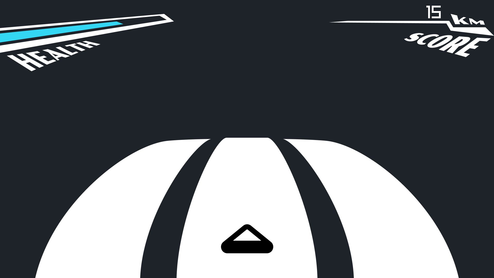

# TriDash

Well hello! This a little personal game that I decided to make, using C++ and raylib (great library 😀). I will keep adding new stuff during my free time (if I do not procrastinate). I tried to make something easy using minimalistic shapes as a first version. It's an endless runner (like Subways Surfers, but without subways or surfers 👍), so the game doesn't really have an end and the score goes up until you get destroyed by the obstacles. Again, this is a very basic game, and I will try to experiment with anything that comes to my mind in terms of design and artstyle.

## "What does the game look like?"

Here is a picture of the game (it's not a AAA game so one screenshot is enough):



## "What tools did you use to make this game?"

You are a very curious person, but I will tell you nonetheless. I mainly used **C++** with the help of **raylib**, a library that include many tools to get started with video-game development.
I also used **Figma** for creating all the design and sprites for the game.

## "Your game looks incredibly fun! How do I run it?"

In case you want to try the game, you have made the right choice! I know my game is incredible and everyone would obviously want to try it...

You can download the project locally and run it using these commands (make sure you're doing it from the project's main directory):

```sh
g++ -std=c++17 -Iinclude -Iraylib/include src/TriDash.cpp src/Button.cpp src/Menu.cpp src/Player.cpp src/Obstacle.cpp src/ObstacleLine.cpp -o build/TriDash.exe -Lraylib/lib -lraylib -lopengl32 -lgdi32 -lwinmm -lws2_32 -static
```
```sh
./build/TriDash.exe
```

Hum... yeah that's it for now 🫠